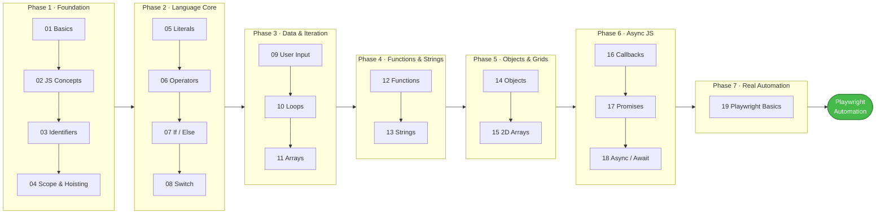

# LEARNPLAYWRIGHTBATCH2X

> A structured, progressive JavaScript curriculum designed to build deep language fluency — from first principles through advanced functional patterns — as a foundation for professional Playwright test automation.

<p align="left">
  
  
  
  
  
</p>

---

## Table of Contents

- [About This Repository](#about-this-repository)
- [Who This Is For](#who-this-is-for)
- [Curriculum Roadmap](#curriculum-roadmap)
- [Curriculum Overview](#curriculum-overview)
- [Project Structure](#project-structure)
- [Chapter Reference](#chapter-reference)
- [Getting Started](#getting-started)
- [Learning Path](#learning-path)
- [Requirements](#requirements)

---

## About This Repository

This repository is a chapter-by-chapter JavaScript curriculum built for QA engineers and developers who want a solid language foundation before writing production-grade Playwright automation. Every chapter contains numbered scripts that progress logically — from concept introduction, to practical examples, to real-world scenarios, to interview-level questions.

The goal is not just to memorize syntax, but to genuinely understand *how* JavaScript works under the hood — so that when you write test automation, you write it with confidence.

---

## Curriculum Roadmap



> Each phase builds directly on the one before it. By the end of Phase 6 you have every language building block needed to read, write, and debug Playwright's async, promise-based API — Phase 7 is where that knowledge gets applied to a real Playwright project.

---

## Who This Is For

| Audience | How to use this repo |
| :------- | :------------------- |
| **Beginner** | Follow chapters 01–06 in order to establish a solid JS foundation |
| **Intermediate** | Jump to chapters 07–12 for control flow, arrays, and functions |
| **QA / SDET** | Use `IQ` files throughout each chapter to prepare for technical interviews |
| **Playwright learner** | Complete all chapters before moving into Playwright — this is your prerequisite |
| **Async / Promises learner** | Jump to chapter 17 for `Promise`, `.then` / `.catch` / `.finally`, `Promise.all` / `allSettled` |
| **Async / Await learner** | Jump to chapter 18 for `async` / `await`, sequential vs parallel execution, `try/catch/finally` |
| **Ready for real Playwright** | Chapter 19 sets up an actual Playwright project — `npm install`, `npx playwright test` |

---

## Curriculum Overview

| # | Chapter | Key Concepts |
| :-: | :------ | :----------- |
| 01 | Basics | Environment setup, Node.js, first script |
| 02 | JavaScript Concepts | Identifiers, naming rules, comments |
| 03 | Identifiers & Literals | VS Code shortcuts, naming conventions |
| 04 | Advanced JS Concepts | `var` / `let` / `const`, scope, hoisting, temporal dead zone |
| 05 | Literals | All literal types — string, number, boolean, null, undefined, template |
| 06 | Operators | Arithmetic, comparison, logical, ternary, nullish coalescing, type operators |
| 07 | If / Else | Conditionals, real-world branching, leap year, API response handling |
| 08 | Switch Statement | Multi-way branching, fall-through, case grouping |
| 09 | User Input | `readline`, `prompt-sync`, interactive console programs |
| 10 | Loops | `for`, `while`, `do...while`, `for...of`, `for...in`, `forEach` |
| 11 | Arrays | Creation, access, mutation, transformation, searching, sorting, slicing |
| 12 | Functions | All 4 types, arrow functions, IIFE, closures, higher-order functions, pure functions |
| 13 | Strings | String methods, searching, transformation, type conversion, cheat sheet |
| 14 | Objects | Object literals, dot/bracket notation, reference vs primitive, destructuring, methods, `this` |
| 15 | 2D Arrays | Grid structure, nested loops, `map`/`reduce` on rows, pattern printing, real-world test matrix |
| 16 | Callbacks | What callbacks are, 3 ways to pass them, sync vs async, callback hell, parameters & return values |
| 17 | Promises | `Promise` states, `resolve` / `reject`, `.then` / `.catch` / `.finally`, chaining, `Promise.all` / `allSettled` |
| 18 | Async / Await | `async` functions, `await`, `try` / `catch` / `finally`, sequential vs parallel execution with `Promise.all` |
| 19 | Playwright Basics | Real Playwright project setup — `package.json`, installing the `playwright` package, running tests with `npx` |

---

## Project Structure

```
LEARNPLAYWRIGHTBATCH2X/
│
├── chapter_01_Basics/
├── chapter_02_Javascript_Concepts/
├── chapter_03_Identifier_Literals/
├── chapter_04_Javascript_Concepts/
├── chapter_05_Literal/
├── chapter_06_double_triple_equal.js/
├── chapter_07_If_else/
├── chapter_08_Switch_Statement/
├── chapter_09_User_Input/
├── chapter_10_Loops/
├── chapter_11_Arrays/
├── chapter_12_Functions/
├── chapter_13_Strings.js/
│   └── javascript_Stringcheatsheet.md   ← String methods quick reference
├── chapter_14_Objects/
├── chapter_15_2D_Array/
├── chapter_16_Callback.js/
├── chapter_17_Promise/
├── chapter_18_Async.js/
└── chapter_19_Playwright_Basics/
    ├── package.json
    └── package-lock.json
```

---

## Chapter Reference

### Chapter 01 — Basics
> `chapter_01_Basics/`

Environment verification and first steps in JavaScript with Node.js.

| File | Topic |
| :--- | :---- |
| `01_Basics.js` | Hello World and console output |
| `02_JS.js` | Script structure and execution model |
| `03_JS_Verify_Setup.js` | Confirming the Node.js environment |
| `04_HotCode.js` | Hot reloading during active development |

---

### Chapter 02 — JavaScript Concepts
> `chapter_02_Javascript_Concepts/`

The building blocks of JavaScript: identifiers, naming rules, and code comments.

| File | Topic |
| :--- | :---- |
| `00_All_Identifier_Examples.js` | All identifier patterns consolidated |
| `05_JS_Basics.js` | High-level language overview |
| `06_JS_Identifier_Rules.js` | Valid and invalid naming rules |
| `07_Identifier_Part2.js` | Edge cases and advanced naming patterns |
| `08_Comments.js` | Single-line, multi-line, and inline comments |

---

### Chapter 03 — Identifiers & Literals Reference
> `chapter_03_Identifier_Literals/`

VS Code keyboard shortcut references for Windows and macOS, and identifier naming conventions.

---

### Chapter 04 — JavaScript Concepts (Advanced)
> `chapter_04_Javascript_Concepts/`

Deep understanding of variable declarations, scope rules, and JavaScript's hoisting mechanism.

| File | Topic |
| :--- | :---- |
| `09_var_let_const.js` | Side-by-side comparison of all three declarations |
| `10_functions.js` | Function declaration fundamentals |
| `11_var_explained.js` | How `var` behaves and why it causes bugs |
| `12_let_people_love.js` | Why the industry moved to `let` |
| `13_const_explained.js` | When and why to reach for `const` |
| `14_var_functionscope.js` | `var` scoping inside functions |
| `15_let_scope.js` | Block-level scoping with `let` |
| `16_Hoisting.js` | Variable hoisting explained step by step |
| `17_Hoisting_fn.js` | Function declaration hoisting |
| `18_let_hoisting.js` | `let` and the temporal dead zone |
| `19_let_hoisting_block.js` | Block-scoped hoisting edge cases |
| `20_let_const.js` | Combined `let` / `const` real-world scenarios |
| `21_Jr_QA.js` | Interview questions for junior QA engineers |

---

### Chapter 05 — Literals
> `chapter_05_Literal/`

Every literal type in JavaScript with clear, runnable examples.

| File | Topic |
| :--- | :---- |
| `22_Literal.js` | Introduction to JavaScript literals |
| `23_null_undefined.js` | The critical distinction between `null` and `undefined` |
| `24_null.js` | Null behavior and use cases |
| `25_Literal_All.js` | All literal types in a single reference file |
| `26_Literal_Number_all.js` | Integer, float, hex, binary, and octal formats |
| `27_String.js` | String literal syntax |
| `28_Template_Literal.js` | Template literals and `${}` interpolation |
| `29_Backtick_single_and_double_string.js` | Comparing all three quote styles |

---

### Chapter 06 — Operators
> `chapter_06_double_triple_equal.js/`

Comprehensive coverage of every JavaScript operator — from arithmetic to nullish coalescing.

| File | Topic |
| :--- | :---- |
| `30_Operator.js` | Operator categories overview |
| `31_Arithmetic_OP.js` | `+`, `-`, `*`, `/` |
| `32_Modulus_OP.js` | `%` remainder operator |
| `33_Expo_OP.js` | `**` exponentiation |
| `34_IQ.js` | Interview question |
| `35_Comparison_OP.js` | `>`, `<`, `>=`, `<=` |
| `36_Comparision_Strict_Loose.js` | `==` vs `===` — loose vs strict equality |
| `37_IQ_Loose_Strict.js` | IQ: equality traps |
| `38_Confusion_Comparsion.js` | Common comparison pitfalls |
| `39_Logical_Op.js` | `&&`, `\|\|`, `!` logical operators |
| `40_String_Con_Op.js` | String concatenation with `+` |
| `41_Ternary_Op.js` | Ternary `? :` conditional operator |
| `42_Type_Op.js` | `typeof` type checking |
| `43_Incre_Decre_Op.js` | `++` and `--` operators |
| `44_Null_Op.js` | Nullish coalescing `??` |
| `45_Post_Incre.js` | Post-increment vs pre-increment |
| `46_IQ_Increment_D.js` | IQ: increment/decrement traps |
| `47_Advance_ID.js` | Advanced operator interview questions |

---

### Chapter 07 — If / Else
> `chapter_07_If_else/`

Conditional logic from basic `if` blocks through real-world API response handling and leap year logic.

| File | Topic |
| :--- | :---- |
| `48_If_Else.js` | Basic `if` / `else` |
| `49_If_Elseif_else.js` | Multi-branch `else if` chains |
| `50_Real_If_else.js` | Real-world conditional example |
| `51_API_If_Else.js` | Handling API HTTP status codes conditionally |
| `52_IQ_If_Else.js` | Interview question |
| `53_If_Else_Real.js` | Advanced real-world scenario |
| `54_IQ.js` | Interview question |
| `55_IE.js` | Edge cases and boundary conditions |
| `56_IQ_1.js` | Interview question 1 |
| `57_IQ_2.js` | Interview question 2 |
| `58_Leap_Year.js` | Leap year calculator |
| `Assignment1–5.js` | Practice assignments |

---

### Chapter 08 — Switch Statement
> `chapter_08_Switch_Statement/`

Multi-way branching, fall-through behavior, default cases, and grouping multiple cases together.

| File | Topic |
| :--- | :---- |
| `59_Switch.js` | Basic switch syntax |
| `60_No_Break.js` | Fall-through behavior without `break` |
| `61_Default.js` | The default case |
| `62_Real_Time_Example.js` | Month and day real-world example |
| `63_Switch_Group.js` | Grouping multiple cases under one handler |
| `64_IQ.js` | Interview question |
| `66_IQ3.js` | Interview question 3 |
| `67_IQ4.js` | Interview question 4 |

---

### Chapter 09 — User Input
> `chapter_09_User_Input/`

Reading and handling user input in Node.js console applications.

| File | Topic |
| :--- | :---- |
| `68_User_Input.js` | Introduction to stdin input |
| `69_Node_Readlline.js` | Asynchronous input with the `readline` module |
| `70_Prompt_Sync.js` | Synchronous input with `prompt-sync` |

---

### Chapter 10 — Loops
> `chapter_10_Loops/`

Every looping construct in JavaScript, with practical use cases and interview-level questions.

| File | Topic |
| :--- | :---- |
| `71_For_Loops.js` | Classic `for` loop |
| `72_For_Loop.js` | Loop variations and patterns |
| `73_For_Loop2.js` | Nested loops |
| `74_IQ.js` | Interview question |
| `75_For_OF_IN_EACH.js` | `for...of`, `for...in`, `forEach` compared |
| `76_While.js` | `while` loop |
| `77_Do_While.js` | `do...while` basics |
| `78_Do_While.js` | `do...while` advanced patterns |
| `79_IQ.js` – `82_IQ.js` | Interview questions series |

---

### Chapter 11 — Arrays
> `chapter_11_Arrays/`

Complete array coverage — from creation and access through transformation, searching, sorting, slicing, and type checking.

| File | Topic |
| :--- | :---- |
| `83_Arrays.js` | Introduction to arrays |
| `84_Array.js` | Array declaration and initialization |
| `85.Access_Array.js` | Accessing and updating elements by index |
| `86_Adding_Removing_Array.js` | `push`, `pop`, `shift`, `unshift` |
| `87_Adding_Remove2.js` | `splice` and additional mutation methods |
| `88_Real_Example.js` | Real-world array use case |
| `89_Searching.js` | `indexOf`, `find`, `findIndex`, `includes` |
| `90_iterate.js` | `forEach` and `for...of` iteration |
| `91_Transform_Array.js` | `map`, `filter`, `reduce`, `sort` |
| `92_Array.js` | Sorting — default string sort vs numeric comparator |
| `93_Array_Slicing.js` | `slice` — non-destructive sub-array extraction |
| `94_Concat_array.js` | `concat` and spread operator to merge arrays |
| `95_Array_Checking.js` | `Array.isArray`, `every`, `some` |
| `Assignment_FizzBuzz.js` | FizzBuzz challenge using array logic |
| `Assignment_TriangleClassifier.js` | Triangle classification assignment |

---

### Chapter 12 — Functions
> `chapter_12_Functions/`

All four function types, arrow functions, IIFE, default/rest/spread parameters, scope, closures, higher-order functions, and pure functions.

| File | Topic |
| :--- | :---- |
| `96_Functions.js` | What functions are and why they matter |
| `97_Type1_Fn_Basic_Funtions.js` | Type 1 — no parameters, no return value |
| `98_Tyoe2_Fn_With_Param_No_Return.js` | Type 2 — with parameters, no return value |
| `99_Type3_Fn_without_Param_Return_Type.js` | Type 3 — no parameters, with return value |
| `100_Type4_Fn_With_Param_With_Return.js` | Type 4 — with parameters and return value |
| `101_Template_Literal.js` | Template literals used inside functions |
| `102_Fn_Expression.js` | Function expressions stored in variables |
| `103_Arrow_Fn.js` | Arrow function syntax and behavior |
| `104_Arrow_Fn_Real.js` | Real-world arrow function — HTTP status code validator |
| `105_IIFE.js` | Immediately Invoked Function Expressions |
| `106_Default_Param_Fn.js` | Default parameter values |
| `107_IQ.js` | Interview question |
| `108_Rest_Param_Fn.js` | Rest parameters (`...args`) |
| `109_IQ_.js` | Interview question |
| `110_Spread_IQ.js` | Spread operator interview question |
| `111_Scope_Fn.js` | Function scope and variable visibility |
| `112_IQ.js` | Interview question |
| `113_Closure.js` | Closures — concept and introduction |
| `114_Closure.js` | Closures — advanced patterns |
| `115_API_REAL_Closure.js` | Real-world closure simulating an API counter |
| `116_Higher_Order_Fn.js` | Higher-order functions, callbacks, `map`, `filter` |
| `117_Pure_Functions.js` | Pure vs impure functions with side-effect examples |

---

### Chapter 13 — Strings
> `chapter_13_Strings.js/`

Comprehensive string method coverage with real-world examples, type conversion, and a built-in cheat sheet reference.

| File | Topic |
| :--- | :---- |
| `118_Strings.js` | Introduction to strings and immutability |
| `119_String_Properties.js` | `length`, index access, `charAt` |
| `120_Search_Checking.js` | `includes`, `startsWith`, `endsWith`, `indexOf`, `search` |
| `121_Substring.js` | `slice` vs `substring` — differences and traps |
| `122_Transform_Str.js` | `toUpperCase`, `toLowerCase`, `trim`, `replace`, `split` |
| `123.SC.js` | String conversion — `toString`, `Number`, `parseInt`, `parseFloat` |
| `javascript_Stringcheatsheet.md` | Complete string methods quick-reference cheat sheet |

### Chapter 14 — Objects
> `chapter_14_Objects/`

Deep coverage of JavaScript objects — from creation and mutation through reference semantics, methods, destructuring, and the full Object API.

| File | Topic |
| :--- | :---- |
| `124_Objects.js` | Complete object reference — literal syntax, dot/bracket notation, add/update/delete, methods, `this`, constructor functions, `Object.keys/values/entries`, spread, destructuring, shorthand, computed keys, `in` / `hasOwnProperty` |
| `125_Objects2.js` | Key-value pairs, JSON vs JS object syntax, dot vs bracket notation, reference behavior |
| `126_Objects_Creation.js` | Object creation and reference equality — `===` compares references, not values |
| `127_Objects_Real.js` | Dynamic property addition, `delete` keyword, real-world config object |
| `128_Primitive_Ref.js` | Primitive vs reference types — copy by value vs copy by reference |
| `129_ObExamples.js` | JSON vs JS object syntax comparison |
| `130_IQ.js` | Interview question — dynamic property access, adding and modifying properties |
| `131_Object_Fn.js` | Functions (methods) inside objects |
| `132_Obj_Decon.js` | Object destructuring — basic extraction, renaming variables, default values, nested destructuring |
| `133_Spread,js` | Spread operator `...` — shallow copying objects into a new independent object |
| `134_Objects_GET_SET_Methods.js` | `get` and `set` — computed properties that read and write like regular values |
| `135_IQ.js` | Interview question — `Object.keys`, `Object.values`, `Object.entries`, `for...in` loop |
| `136_Obj_Real.js` | Real-world objects — test environment config, expected API response, project config with `process.env` |
| `137_let_const_odj.js` | `let` vs `const` with objects — when each is appropriate and the golden rule |

### Chapter 15 — 2D Arrays
> `chapter_15_2D_Array/`

Arrays of arrays — understanding grid structure, nested loops, functional operations on rows, and real-world test matrix use cases.

| File | Topic |
| :--- | :---- |
| `138_2D_Array.js` | 2D array basics — grid structure, `grid[row][col]` access, nested `for` loops |
| `139_2d.js` | Matrix vs grid — size notation, `grid.length` for rows, `grid[0].length` for columns |
| `140_Real.js` | Real-world test matrix — nested loops, `for...of`, `forEach` to find failed test cases |
| `141_2d_Array_Functions.js` | `map` + `reduce` to sum each row, filtering failed tests with `.includes()` |
| `142_IQ_Right_Pyramid_Pattern.js` | Interview question — right pyramid star pattern using nested loops |

### Chapter 16 — Callbacks
> `chapter_16_Callback.js/`

The foundation of asynchronous JavaScript — understanding what a callback is, how to pass one, when JavaScript uses them, and how they connect directly to the way Playwright test functions work.

| File | Topic |
| :--- | :---- |
| `143_Callback.js` | Introduction to callbacks — what they are and two ways to pass them (named vs anonymous) |
| `145_Callback.js` | Three ways to pass a callback — named function, anonymous function, arrow function |
| `146_CB.js` | Playwright-style `test()` call — a callback in the exact shape Playwright expects |
| `147_CB_Fn.js` | Real-world analogy — cafe reservation scenario showing callback timing |
| `148_PW_CB.js` | How Playwright's `test()` works under the hood — a hand-built version to show the pattern |
| `149_JS_cB.js` | Synchronous vs asynchronous — `setTimeout` demo showing JS does not wait |
| `150_Synch_CB.js` | Synchronous callback with `forEach` iterating a test results array |
| `151_Asynch.js` | Asynchronous callback with `setTimeout` simulating a delayed API response |
| `152_callback_hell.js` | Callback hell / Pyramid of Doom — 5-step nested example showing why this pattern breaks |
| `153_CB_Parameter.js` | Callbacks without parameters vs callbacks that receive data from the caller |
| `153_CB_Return.js` | Callbacks that return values — `calculate` function delegating math to a named or anonymous callback |

---

### Chapter 17 — Promises
> `chapter_17_Promise/`

The modern alternative to callbacks — creating promises, resolving/rejecting them, chaining `.then()`, handling errors with `.catch()`, cleanup with `.finally()`, and running multiple promises together with `Promise.all` / `Promise.allSettled`.

| File | Topic |
| :--- | :---- |
| `154_Promise.js` | Introduction to `Promise` — the executor function, `resolve` / `reject`, and why logging a promise shows its state, not its value |
| `155_Promise_REAL_API.js` | Simulating a real API call with a resolved promise, consumed with `.then()` |
| `156_Promise_API_Part2.js` | Handling a rejected promise with `.catch()` |
| `157.finally.js` | `.finally()` — code that always runs regardless of resolve/reject |
| `158_Call_Py_Problem.js` | Promise chaining — solving callback hell by returning a promise from each `.then()` |
| `159_Promis_ALL.js` | `Promise.all()` vs `Promise.allSettled()` — fail-fast vs wait-for-everyone semantics |
| `160_Promise_IQ.js` | Interview questions — chaining, error propagation, `Promise.resolve` / `reject`, `Promise.all` / `allSettled` |

---

### Chapter 18 — Async / Await
> `chapter_18_Async.js/`

The cleanest way to work with promises — `async` functions and `await` let asynchronous code read top-to-bottom like synchronous code, paired with `try` / `catch` / `finally` for error handling and `Promise.all` for running work in parallel.

| File | Topic |
| :--- | :---- |
| `161_Async.js` | Introduction to `async` / `await` with `try` / `catch` / `finally` — handling a rejected promise |
| `162_Asunc_p2.js` | `await` unwrapping a resolved promise — the same pattern Playwright uses for `await page.goto()` |
| `163_PyOfDOM.js` | Rewriting a Promise-chain (Pyramid of Doom) using `async` / `await` instead of `.then()` |
| `164_Async_Ex.js` | A real Playwright test file — `async ({ page }) =>`, `await page.goto()`, `await expect(page).toHaveTitle()` |
| `165_AA.js` | Sequential `await` calls — each one waits for the previous to finish (~3 seconds for 3 calls) |
| `166_AA_PromiseAll.js` | Parallel execution with `await Promise.all([...])` — all calls run together (~1 second total) |
| `167_IQ.js` | Interview questions — `async` function return values, sequential `await` flow |

---

### Chapter 19 — Playwright Basics
> `chapter_19_Playwright_Basics/`

The first real Playwright project setup — where all the JavaScript fundamentals from chapters 01–18 (functions, objects, promises, async/await) come together to write and run actual browser automation tests.

| File | Topic |
| :--- | :---- |
| `package.json` | Project manifest declaring `playwright` as a dependency and the `test` script |
| `package-lock.json` | Locked dependency versions for reproducible installs |

> Playwright is installed **locally** in this project (not globally), so its commands must be run with `npx playwright ...` from inside this folder — not the bare `playwright` command.

---

## Getting Started

### Prerequisites

- [Node.js](https://nodejs.org/) v16 or later (LTS recommended)
- [Visual Studio Code](https://code.visualstudio.com/)
- Playwright (optional — for automation examples): `npm i -D playwright`

### Installation

```bash
# 1. Clone the repository
git clone https://github.com/Tush783/LEARNPLAYWRIGHTBATCH2X.git
cd LEARNPLAYWRIGHTBATCH2X

# 2. Install dependencies (required only for prompt-sync or Playwright)
npm install
```

### Running a Script

```bash
# Run any chapter script directly with Node.js
node chapter_01_Basics/01_Basics.js
node chapter_12_Functions/117_Pure_Functions.js
node chapter_13_Strings.js/121_Substring.js
node chapter_17_Promise/158_Call_Py_Problem.js
node chapter_18_Async.js/165_AA.js
```

### Running Playwright Tests

```bash
# from the repo root
npx playwright test

# from chapter_19_Playwright_Basics specifically (Playwright is a local dependency there)
cd chapter_19_Playwright_Basics
npm install
npx playwright test
```

---

## Learning Path

Follow this sequence for the most effective learning experience:

```
Phase 1 — Foundation
  Chapter 01  →  Environment setup and first script
  Chapter 02  →  Identifiers and language basics
  Chapter 03  →  VS Code shortcuts and naming conventions
  Chapter 04  →  var / let / const, scope, and hoisting

Phase 2 — Language Core
  Chapter 05  →  Literals and data types
  Chapter 06  →  All operators
  Chapter 07  →  Conditional logic
  Chapter 08  →  Switch statements

Phase 3 — Data & Iteration
  Chapter 09  →  User input
  Chapter 10  →  All loop types
  Chapter 11  →  Arrays — full coverage

Phase 4 — Functions & Strings
  Chapter 12  →  Functions — all types, closures, HOF, pure functions
  Chapter 13  →  Strings — methods, transformation, conversion

Phase 5 — Objects & 2D Arrays
  Chapter 14  →  Objects — literals, reference semantics, destructuring, methods
  Chapter 15  →  2D Arrays — grids, nested loops, map/reduce, test matrices

Phase 6 — Asynchronous JavaScript
  Chapter 16  →  Callbacks — sync vs async, 3 ways to pass, callback hell, parameters & return values
  Chapter 17  →  Promises — resolve/reject, .then/.catch/.finally, chaining, Promise.all/allSettled
  Chapter 18  →  Async/Await — async functions, try/catch/finally, sequential vs parallel await

Phase 7 — Real Automation
  Chapter 19  →  Playwright Basics — project setup, npx playwright test, your first real test
```

> Each chapter's `IQ` files simulate real technical interview questions for QA / SDET roles. Review them after completing each chapter.

---

## Requirements

| Tool | Version | Notes |
| :--- | :------ | :---- |
| Node.js | 16+ LTS | [nodejs.org](https://nodejs.org/) |
| npm | Bundled with Node.js | No separate install needed |
| Visual Studio Code | Latest | [code.visualstudio.com](https://code.visualstudio.com/) |
| Playwright | Latest | `npm i -D playwright` — optional |

---

## Notes

- All scripts are written for **learning and clarity**, not production use.
- Experiment freely — modifying examples is the fastest way to build intuition.
- The `IQ` files throughout each chapter mirror real interview questions for QA / developer roles.
- Chapter 13 includes a standalone `javascript_Stringcheatsheet.md` — a complete string methods reference.
- Chapter 17 (`Promise`) is the direct language foundation for Playwright's `async` / `await` test syntax.
- Chapter 18 (`Async` / `Await`) is exactly the syntax Playwright test files are written in — `async ({ page }) => { await page.goto(...) }`.
- Chapter 19 is a real, installable Playwright project — remember to run its commands with `npx`, not a bare `playwright` command, since it's a local (not global) dependency.

---

<p align="center">
  <sub>_Last updated: July 5, 2026 — Chapter 19 (Playwright Basics) complete_</sub>
</p>
